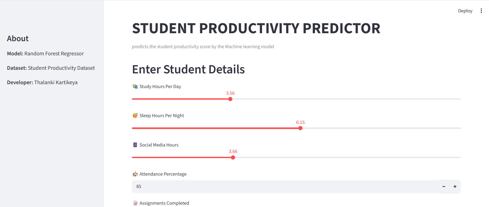
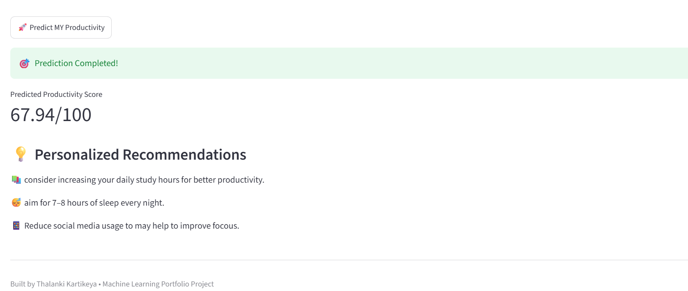

# 🎓 Student Productivity Predictor
# Home page



## 📖 Overview

Student productivity is influenced by many factors such as study hours, sleep, attendance, stress, social media usage, and previous academic performance. The goal of this project is to predict a student's productivity score using Machine Learning and provide simple recommendations based on the user's inputs.

This project covers the complete Machine Learning workflow, starting from data preprocessing and exploratory data analysis to model training, evaluation, and deployment using Streamlit. Instead of keeping the model inside a Jupyter Notebook, it was converted into an interactive web application that anyone can use.

---

## ✨ Features

- Predicts a student's productivity score.
- Interactive web application built with Streamlit.
- Personalized recommendations based on user inputs.
- Clean and easy-to-use interface.
- Trained Machine Learning model for real-time predictions.

---

## 📊 Dataset

The project uses a Student Productivity dataset containing academic and lifestyle-related features such as:

- Study Hours Per Day
- Sleep Hours Per Night
- Social Media Hours
- Attendance Percentage
- Assignments Completed
- Stress Level
- Physical Activity Hours Per Week
- Previous Semester GPA

These features were used to train the Machine Learning model to estimate a student's productivity score.

---

## 🧠 Machine Learning Approach

The dataset was cleaned and explored before training the model. Different visualizations were created to understand how each feature affects productivity.

A **Random Forest Regressor** was selected because it performs well on structured data and can learn complex relationships between multiple features without requiring extensive tuning.

After training, the model was saved using **Joblib** and later loaded into the Streamlit application for making predictions.

---

## 📈 Model Performance

The final model achieved:

- **R² Score:** 0.80
- **Mean Absolute Error (MAE):** 3.7

These results indicate that the model provides reasonably accurate predictions for the given dataset.

---

## 🛠 Technologies Used

- Python
- Pandas
- NumPy
- Scikit-learn
- Streamlit
- Joblib
- Matplotlib

---

## 🚀 How to Run

1. Clone this repository.
2. Install the required libraries.

```bash
pip install -r requirements.txt
```

3. Start the Streamlit application.

```bash
python -m streamlit run app.py
```

4. Enter the required student details and click **Predict My Productivity** to view the predicted productivity score along with personalized recommendations.

---

## 📂 Project Structure

```text
Student-Productivity-Predictor/
│
├── app.py
├── README.md
├── requirements.txt
├── .gitignore
│
├── data/
│   └── Student_Productivity_Dataset.csv
│
├── notebook/
│   ├── project.ipynb
│   └── productivity_model.pkl
│
└── images/
```

---

## 🔮 Future Improvements

Some improvements that can be added in the future include:

- Better UI and user experience.
- Support for multiple prediction models.
- More detailed visualizations and insights.
- Prediction history and report generation.

---

## 👨‍💻 Developer

**Thalanki Kartikeya**

B.Tech Artificial Intelligence & Data Science

Shiv Nadar University Chennai

This project was built as part of my learning journey in Machine Learning to understand the complete process of developing and deploying an ML application.